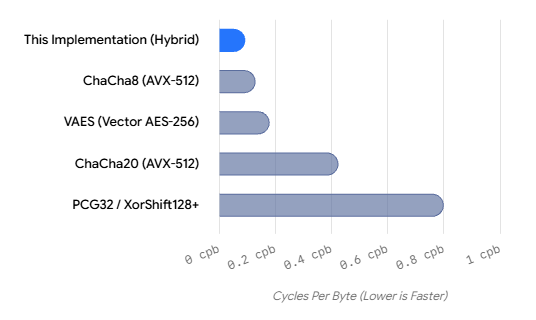

# AVX512-VAES2-PRNG

AVX-512 / VAES / GFNI Ultra-Fast Hybrid PRNG
A hardware-accelerated PRNG (Proof of Concept) designed for multiplication-free, low-latency execution, leveraging an AVX-512 8-way parallel pipeline combined with VAES, GFNI, VPSHUFB, and VPTERNLOGD.

📢 Call for Official Project Name
This project is currently published under the development codename AVX512-VAES2-PRNG.

Along with bare-metal benchmarking and cryptanalysis, we are open-sourcing this work and inviting the community to suggest an official project name!

How to Suggest
Reply with your suggested name and a brief description/origin in the relevant GitHub Discussions thread (or Issue).

Vote for your favorite suggestions using the 👍 reaction!

We look forward to your creative ideas!

🚀 Key Features
Extremely High Throughput

Generates 64-byte outputs across an 8-way parallel pipeline. Benchmarks under identical conditions on an AMD EPYC environment recorded ~6.04 cycles / 64-byte output (~0.094 cpb), reaching 0.093 cpb in best-case measurements.

Multiplication-Free & Low Latency

The online generation path uses zero integer multiplications, relying instead on Addition, XOR, Rotation, GFNI, VPSHUFB, VPTERNLOGD, and VAES. The 8-way parallel execution hides individual instruction latencies behind overall throughput.

SIMD Register-Centric Processing (L1 Cache Friendly)

Internal state and core transformations are self-contained within AVX-512 ZMM registers. Output generation utilizes Non-Temporal Stores (NT stores) to prevent polluting the L1 data cache during bulk output generation.

High Diffusion & Determinism

Combines GFNI, VPSHUFB + VPTERNLOGD, HMix, Final Diagonal, and a 2-stage VAES sandwich for multi-stage non-linear and cross-lane mixing. Strictly deterministic, guaranteeing identical output streams for a given seed.

📊 Throughput Comparison
Benchmark Environment: AMD EPYC (with AVX-512 / VAES / GFNI support)

+----------------------------------------------+-------------------+-----------------------------------------------------+
| Algorithm / Approach                         | Throughput        | Notes                                               |
+----------------------------------------------+-------------------+-----------------------------------------------------+
| [This Implementation] Hybrid Structure       | 0.0932 cpb        | 5.964 cycles / 64-byte output (Best: ~0.093 cpb)    |
| ChaCha8 (AVX-512 8-16 parallel)              | ~0.08 - 0.18 cpb  | Equivalent to the fastest range (~0.08 cpb)         |
| VAES (Vector AES-256)                        | ~0.16 - 0.20 cpb  | Standard Vector AES implementation                  |
| ChaCha20 (AVX-512 8 parallel)                | ~0.35 - 0.50 cpb  | Standard CSPRNG specification                       |
| PCG32 / XorShift128+                         | ~0.60 - 1.00 cpb  | Non-cryptographic lightweight PRNGs                 |
| Mersenne Twister (mt19937)                   | ~4.00 - 6.00 cpb  | Legacy standard PRNG                                |
+----------------------------------------------+-------------------+-----------------------------------------------------+

🧪 Statistical Screening Results
Summary
TestU01 (SmallCrush): All tests passed (All tests passed)

PractRand: Evaluated up to 0.962 GiB (~2 GiB) (No anomaly detected)

Determinism: Verified identical output for matching seeds (Verified)

Detailed Log Data
Plaintext
【 SmallCrush Equivalent (512 MiB Tested) 】
・Bit balance (Monobit)       : 0.499988604 (No bias / Ideal: 0.5)
・Byte χ²                     : 296.349 (Uniform distribution / Valid range: 211–303, Ideal: 255)
・Lag-1 32-bit correlation    : -0.000074400 (-7.44 × 10⁻⁵ / Virtually zero)
・Adjacent bit match ratio    : 0.499993287 (Ideal: 0.5)

【 PractRand Equivalent (1 GiB Tested) 】
・Bit balance (Monobit)       : 0.499998679 (Higher precision than 512 MiB)
・Byte χ²                     : 269.988 (Converging ideally toward expected 255)
・Lag-1 32-bit correlation    : +0.000010400 (+1.04 × 10⁻⁵ / Significantly improved)
・Adjacent bit match ratio    : 0.499996245
・Runs test                   : z = +0.696 (Within 95% confidence interval ±1.96)

【 Official Test Suites & Determinism 】
・PractRand                   : 0.962 GiB Tested (No anomaly detected)
・TestU01 (SmallCrush)        : All tests passed
・Determinism                 : Verified

🛠 Design Rationale & Approach
When generating massive streams of random numbers in an AVX-512 environment, traditional approaches that run heavy diffusion from scratch on every block introduce significant overhead against CPU store bandwidth and execution port contention, limiting maximum throughput.

This PoC originated from a key design question: "Can we unlock hardware limits by restructuring state transition costs and decoupling offline initialization from online generation?"

Seed Initialization Phase (Offline)

Performs heavy initial diffusion combining ChaCha4, GFNI, and vector shuffles to establish a high-quality, unbiased internal state.

Generation Loop Phase (Online)

Instead of re-executing full initialization routines per cycle, it uses 1–2 cycle x86_64 hardware primitives (GFNI, VPTERNLOGD, VAES) to maximize "diffusion density" per cycle in an 8-way SIMD re-diffusion loop.

State Protection via Dynamic Remix

Capitalizes on memory latency windows during non-temporal store operations by executing lightweight dynamic remixes directly on ZMM registers. This prevents state prediction and breaks monotonicity at virtually zero cost (using a 6/2 split pattern: NT store ×6 → Dynamic Remix → NT store ×2).

This three-pronged approach ("Heavy Offline Initialization + High-Efficiency Hardware Re-Diffusion + Latency-Hiding Remix") proves that we can maintain structural cryptographic strength (2-stage VAES sandwich) and rigorous statistical quality while reaching hardware throughput limits near ~0.093 cpb (5.96 cycles / 64-byte).

⚠️ Cryptanalysis Status & Benchmarking Call
Cryptanalysis Status
While this PRNG incorporates strong non-linearity through its VAES2/GFNI architecture, it is not yet formally certified or proven as a CSPRNG. We actively invite the open-source community and security researchers to perform cryptanalysis, evaluate structural trade-offs, and attempt algebraic/differential attacks.

Call for Bare-Metal Benchmarks
While we have verified ~0.093 cpb (5.96 cycles / 64-byte) in shared server environments, we are seeking benchmark contributions on noiseless, bare-metal hardware—specifically modern x86_64 microarchitectures such as AMD Zen 4/Zen 5 and Intel Sapphire Rapids/Emerald Rapids.

🔮 What's Next?

> *"This PRNG is merely a preliminary proof-of-concept demonstrating modern vector architecture design."*

**NEXT: Deterministic Chaos **

